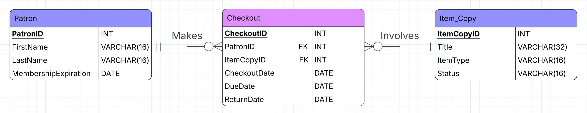

# Sprint 0

This directory contains multiple documents produced during
Sprint 0 of the Wayback Public Library project that show off the design
and analysis of the WPL narrative.

## Models

Contains a data model for the proof of concept.
### Proof of Concept Data Model

## Requirements

Will contain requirements documentation, user stories, acceptance criteria,
and client requirement clarifications.
